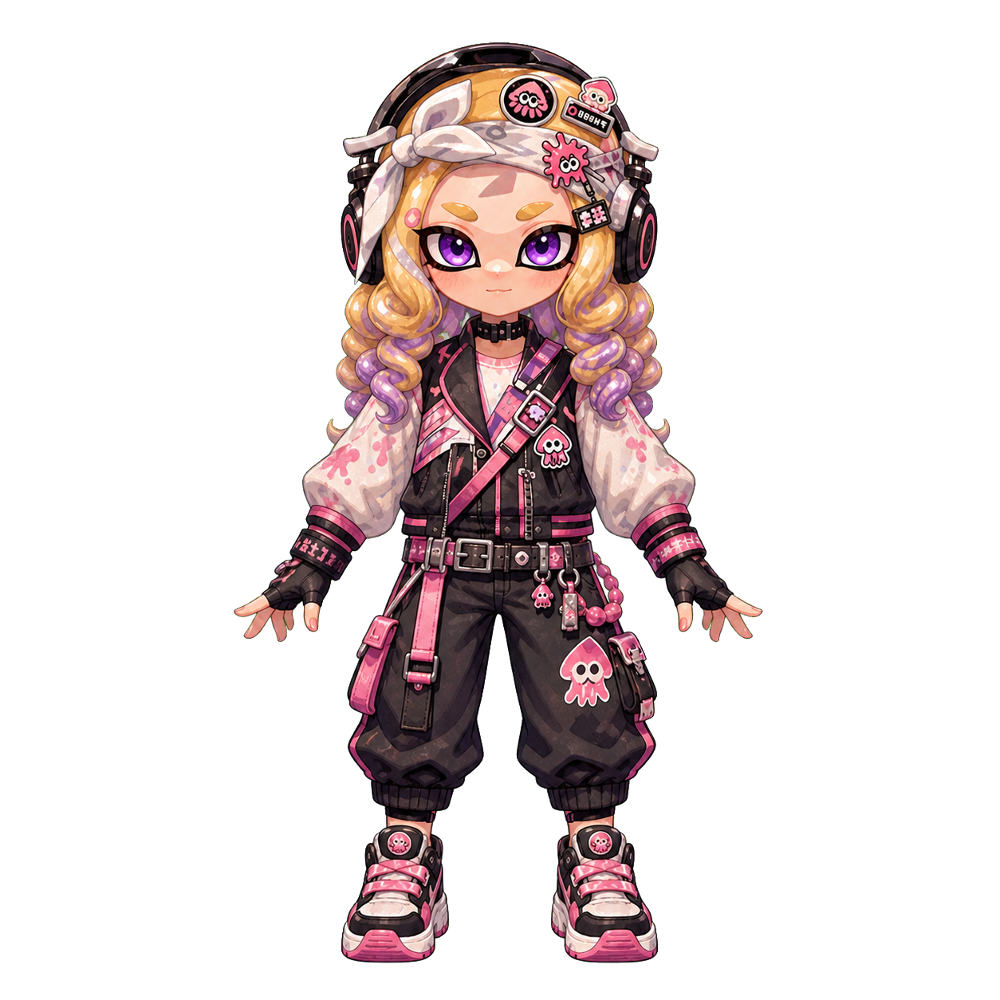
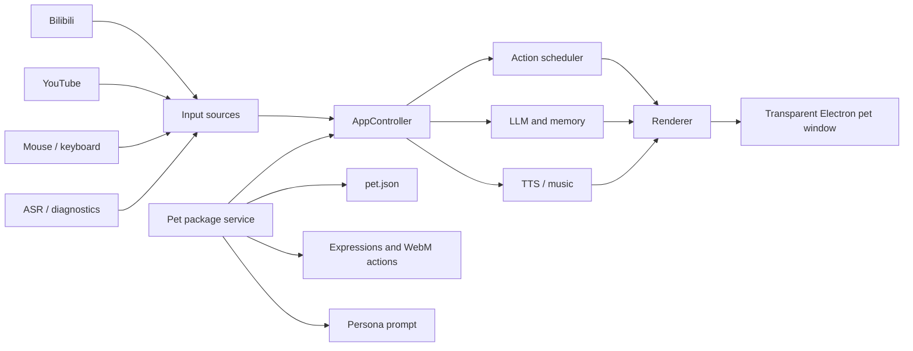

# PetWeaver

> A local-first, extensible Windows desktop-pet runtime with reusable character packages, a complete 44-action animation contract, live-stream interaction, AI conversation, speech, and a Codex-assisted asset pipeline.

[简体中文](README.zh-CN.md) · [Pet package specification](docs/pet-packages.md) · [Live adapter specification](docs/live-adapters.md) · [Migration roadmap](PETWEAVER_MIGRATION_AND_RELEASE_PLAN.md)

<p align="center">
  
</p>

## Project status

PetWeaver is the framework extracted from **Fafa Desktop Pet**, a working Windows desktop companion originally built around one character. The current `main` branch is the **v0.4 alpha line**: Fafa remains the built-in default character, while identity, persona, expressions, and animation assets are being separated into installable pet packages.

This is not a single ImageGen call wrapped in an app. PetWeaver combines a deterministic runtime, a real action registry, event routing, animation scheduling, package validation, media processing, and quality checks. Image generation is used only as one visual-production step.

Current release state:

- Application metadata: `0.4.0-alpha.1`
- Platform: Windows 10/11 x64
- Runtime tests: 288 passing tests across 47 test files
- Built-in character: Fafa
- Pet package loading: implemented for unpacked directories
- ZIP install/update/uninstall: planned for v0.4
- UI language: currently Chinese-first; English documentation is the public default

## Why PetWeaver exists

Most desktop-pet projects tightly couple one character to one application. Replacing the character often means editing source code, renaming assets, changing action logic, and rebuilding the whole app.

PetWeaver separates those responsibilities:

- **The runtime** owns windows, physics, action scheduling, live events, AI, speech, security, and rendering.
- **A pet package** owns character identity, persona, expressions, action media, and fallback rules.
- **The generation skill** helps creators produce and validate a complete animation set without weakening the runtime contract.

The goal is to let artists and developers design their own desktop characters while reusing the same tested application core.

## Highlights

### Reusable pet packages

A `pet.json` manifest describes the character name, version, runtime compatibility, persona, expressions, renderer settings, and action assets. PetWeaver discovers external packages from the user-data directory and can switch the active character without replacing application code.

### Complete 44-action contract

The runtime registry contains 44 entries: 40 planned character actions plus four system actions (`state_move`, `state_observe`, `state_talking`, and `transition_settle`). Forty-three are enabled by default; the legacy introduction action remains registered for compatibility.

Packages must provide their own enabled action media or declare an explicit, valid fallback chain. Missing files, fallback cycles, unsafe paths, and undeclared resources are rejected.

### Codex-assisted animation production

[`skills/petweaver-pixel-pet`](skills/petweaver-pixel-pet/SKILL.md) is a repository-native Codex skill for producing a full package. It reads the actual action registry and creates all required tasks instead of maintaining a shortened, generic sprite list.

Its workflow covers:

1. Canonical character reference preparation.
2. Action-specific eight-pose sheet generation with ImageGen.
3. Human review for identity, silhouette, motion semantics, and layout.
4. Deterministic frame extraction and normalization.
5. Transparent VP9 WebM encoding.
6. Coverage, metadata, path, duration, frame-rate, and alpha validation.

### Live-stream interaction

PetWeaver normalizes platform-specific messages into one internal event contract. The current adapters support:

- Bilibili live rooms.
- YouTube Live Chat through the YouTube Data API.
- Mock events for offline development and diagnostics.

Normalized events include chat messages, gifts, paid messages, memberships, room entry, and connection status. Platform adapters never select animations directly; the controller and scheduler remain platform-independent.

### AI, memory, and voice

Optional integrations include:

- DeepSeek and OpenAI-compatible chat endpoints.
- Per-character persona prompts from the active pet package.
- Local MiniLM embeddings for lightweight memory retrieval.
- Edge TTS without an API key.
- Alibaba Cloud Bailian TTS and ASR.
- Local Voicebox speech and transcription.
- Push-to-talk and configurable voice reactions.

All external services are disabled by default. The desktop pet and diagnostic simulator work offline without API keys.

### Native desktop behavior

- Transparent, always-on-top Electron window.
- Click, double-click, drag, toss, gravity, docking, sleep, and wake behavior.
- Click-through hotkey for streaming and desktop work.
- System tray controls and safe shutdown.
- Action priorities, interruption rules, cooldowns, and persistent states.
- OBS-friendly window capture.
- Optional Live2D and VTube Studio integration.

## Architecture



| Layer | Responsibility |
| --- | --- |
| `src/main/core` | Action registry, scheduler, configuration, package validation, pure runtime rules |
| `src/main/live` | Platform adapters and normalized live-event contract |
| `src/main/providers` | LLM, TTS, ASR, music, Live2D, and VTube Studio integrations |
| `src/main/pet-package-service.js` | Package discovery, validation, active-package fallback, and resource authorization |
| `src/renderer` | Pet playback, settings, gesture handling, and live overlay UI |
| `skills/petweaver-pixel-pet` | Codex workflow and deterministic animation-production utilities |
| `tests` | Runtime, adapter, package, renderer, physics, security, and provider tests |

## Quick start

### Requirements

- Windows 10 or Windows 11, x64.
- Node.js 20 or newer.
- [pnpm](https://pnpm.io/) 9 or newer.

### Install and run

```powershell
git clone https://github.com/junnian910/PetWeaver.git
cd PetWeaver
pnpm install
pnpm dev
```

The first launch does not require an API key. Open the settings window and use the diagnostics page to simulate chat, gifts, paid messages, and memberships.

## Basic controls

- Drag the character to move it.
- Click or double-click it to trigger interactions.
- Right-click the character or use the gear button to open settings.
- Press `Ctrl+Alt+F` to toggle click-through mode.
- Use the system tray to show the pet, open settings, or exit safely.

## Creating a custom pet

An unpacked package uses this structure:

```text
my-pet/
  pet.json
  references/canonical.png
  frames/idle_breath/00.png
  videos/idle_breath.webm
  videos/<action-id>.webm
  qa/validation.json
```

Minimal manifest example:

```json
{
  "schemaVersion": 1,
  "id": "my-pet",
  "displayName": "My Pet",
  "version": "0.1.0",
  "runtime": { "minimumVersion": "0.4.0" },
  "renderer": {
    "type": "video-actions",
    "width": 384,
    "height": 416,
    "fallbackAction": "idle_breath"
  },
  "persona": {
    "prompt": "You are a cheerful desktop companion."
  },
  "expressions": {
    "neutral": "frames/idle_breath/00.png",
    "happy": "frames/emo_happy/00.png"
  },
  "actions": {
    "idle_breath": {
      "asset": "videos/idle_breath.webm",
      "enabled": true,
      "loop": true,
      "fallback": null
    }
  }
}
```

To install an unpacked package:

1. Open **Settings → Avatar and Motion Capture**.
2. Select **Open pet package directory**.
3. Copy the package to `<pet-package-root>/<pet-id>/pet.json`.
4. Ensure the directory name matches the manifest `id`.
5. Select **Rescan**, then choose the package from the list.

See the full [pet package specification](docs/pet-packages.md) for validation and media requirements.

## Media contract

The current video-action renderer expects:

- Canvas: 384 × 416.
- Frame rate: 60 fps.
- Typical duration: 1.6–3.2 seconds.
- Codec: VP9 WebM.
- Transparent background / alpha metadata.
- Package-relative paths only.
- A required `neutral` expression.

ImageGen output is never bound directly to the application. Generated sheets must pass deterministic extraction, normalization, encoding, and QA before they become runtime assets.

## Live-platform setup

### Bilibili

Select Bilibili, disable mock mode, and enter a room ID. Anonymous read-only access is preferred; an optional cookie can be stored through Windows secure storage when required.

### YouTube

Select YouTube and provide either:

- A livestream URL or video ID plus a YouTube Data API key, or
- A known Live Chat ID plus the API key.

The adapter resolves `activeLiveChatId`, follows the server-provided polling interval, advances with `nextPageToken`, and skips existing history on the first connection. See [live adapters](docs/live-adapters.md) for the event mapping.

## Configuration and security

- Renderer processes use Electron sandboxing and context isolation.
- Renderer-to-main communication is restricted to the preload allowlist.
- Pet media is served through the restricted `pet-resource://` protocol.
- Package paths must be relative and cannot escape the package directory.
- Only manifest-declared actions and expressions are exposed to the renderer.
- Invalid packages fall back to the built-in Fafa package with a visible warning.
- API keys are excluded from public configuration snapshots and use Windows secure storage where supported.
- External AI, speech, and live services are opt-in.

Never commit API keys, cookies, voice profiles, or generated desktop builds.

## Development commands

```powershell
# Start Vite and Electron in development mode
pnpm dev

# Run all Vitest suites
pnpm test

# Validate JavaScript syntax
pnpm check

# Validate the complete action-video set
pnpm validate:actions

# Apply release-level action validation
pnpm validate:actions:release

# Build renderer assets
pnpm build:web

# Test, build renderer assets, and create a Windows installer
pnpm build
```

## Testing

The repository currently includes 288 tests covering, among other areas:

- Action registry and scheduler behavior.
- Package manifest validation and secure resource resolution.
- Renderer fallbacks and custom protocol URLs.
- Bilibili and YouTube adapters.
- Physics, dragging, tossing, gestures, and docking.
- Quiet hours, reminders, relationships, and event deduplication.
- TTS, ASR, memory, music, and VTube Studio providers.
- Push-to-talk and voice reaction lifecycle.

Before submitting a change:

```powershell
pnpm test
pnpm check
pnpm build:web
```

## Repository layout

```text
PetWeaver/
├─ src/main/                     Electron main process and runtime services
├─ src/preload/                  Renderer API allowlist
├─ src/renderer/                 Pet, settings, and live-widget UI
├─ public/assets/                Built-in Fafa expressions and action videos
├─ models/                       Bundled local MiniLM embedding model
├─ remotion-pet/                 Source compositions and action pose assets
├─ skills/petweaver-pixel-pet/   Codex pet-generation skill
├─ scripts/                      Validation, QA, rendering, and diagnostics
├─ tests/                        Vitest test suite
└─ docs/                         Package and live-adapter contracts
```

## Roadmap

### v0.4 — character/runtime separation

- [x] Pet manifest validation.
- [x] Built-in Fafa package.
- [x] External unpacked-package discovery.
- [x] Secure package-resource protocol.
- [x] Dynamic action, expression, and persona binding.
- [x] Package selection in settings.
- [x] Bilibili and YouTube adapter boundary.
- [x] Complete 44-action Codex generation skill.
- [ ] ZIP package install and uninstall.
- [ ] Package source/signature warning.
- [ ] Package upgrade policy.
- [ ] Automated third-party compatibility fixtures.
- [ ] Complete English UI localization.

### Later

- Additional live-platform adapters.
- A public package template and example character.
- Versioned package schema migrations.
- Creator-facing package inspection and repair tools.
- Reproducible GitHub release automation.

## Contributing

Issues and focused pull requests are welcome. Useful contributions include:

- Runtime and package-contract tests.
- New live-platform adapters that preserve the normalized event contract.
- Validation and media-pipeline improvements.
- Accessibility and English localization.
- Documentation fixes and example packages using original or properly licensed assets.

Please keep character-specific behavior in pet packages whenever possible. Changes to the runtime contract should include tests and migration notes.

## Documentation

- [Pet package specification](docs/pet-packages.md)
- [Live adapter specification](docs/live-adapters.md)
- [PetWeaver migration and release plan](PETWEAVER_MIGRATION_AND_RELEASE_PLAN.md) — currently Chinese
- [Pixel-pet Codex skill](skills/petweaver-pixel-pet/SKILL.md)

## License

PetWeaver's source code is licensed under the [Apache License 2.0](LICENSE).

Character artwork, animation, voice, music, fonts, model files, and other media may have separate terms. A pet package must document those rights before it is redistributed; the Apache-2.0 license does not automatically cover third-party media bundled with a character.
